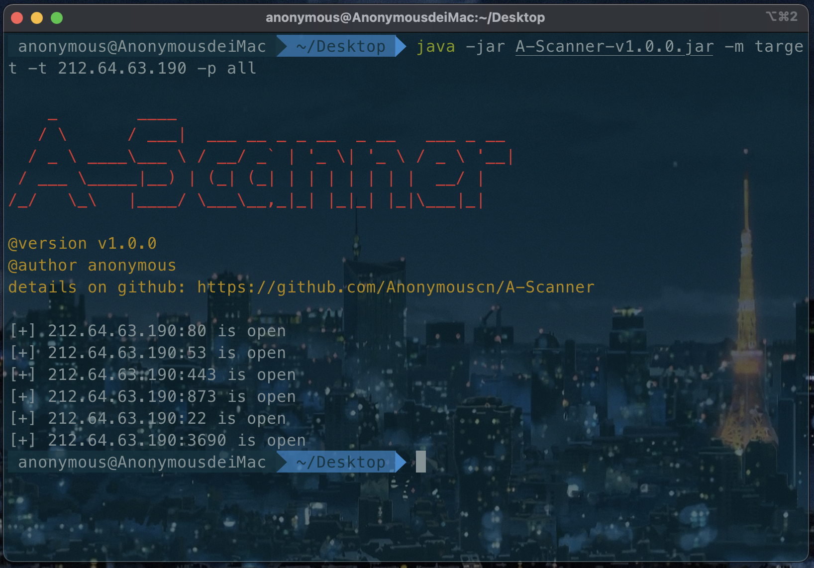
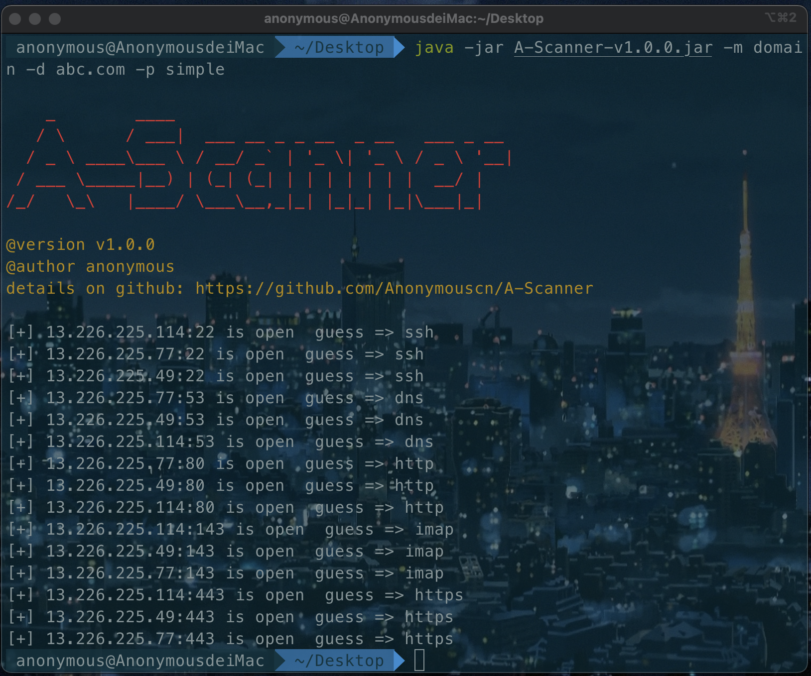
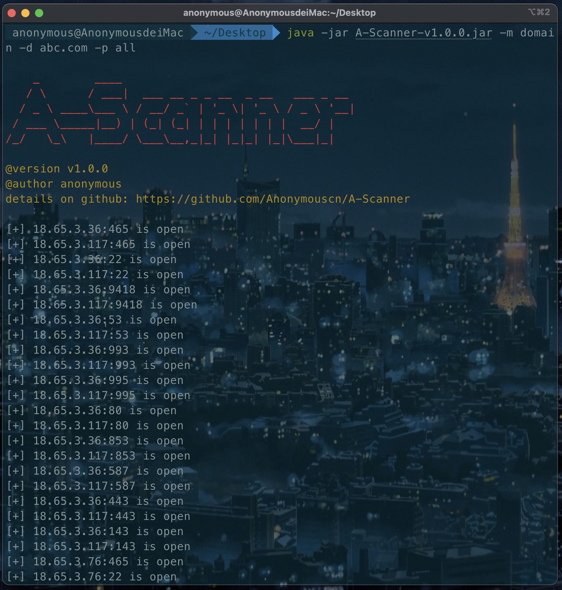
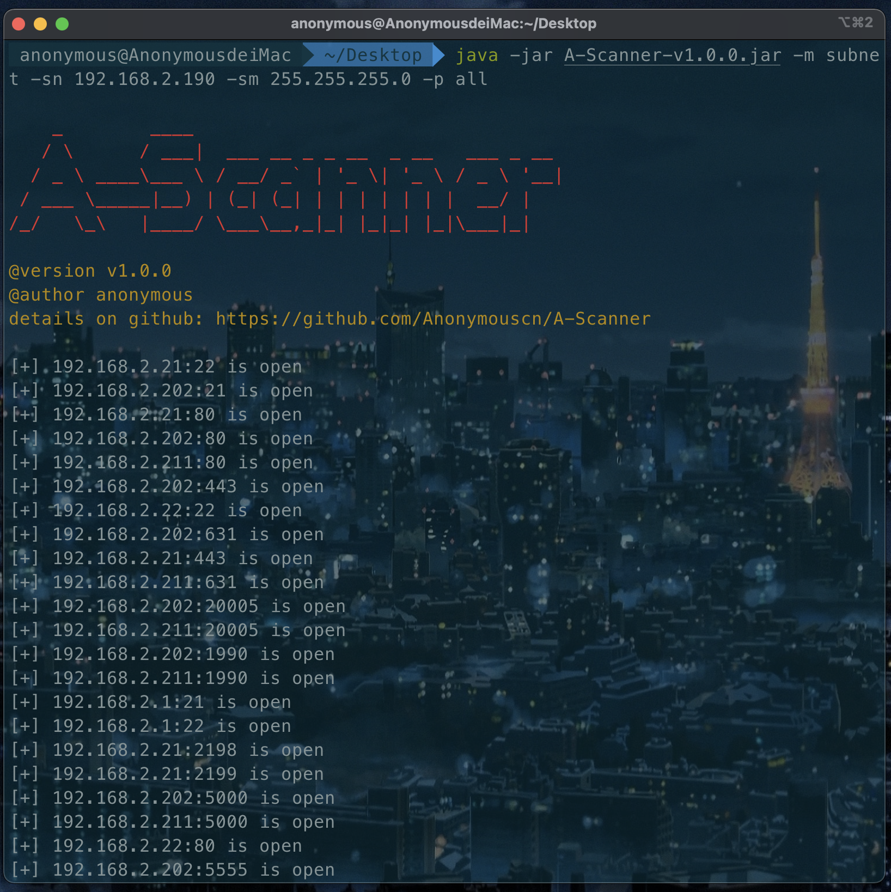
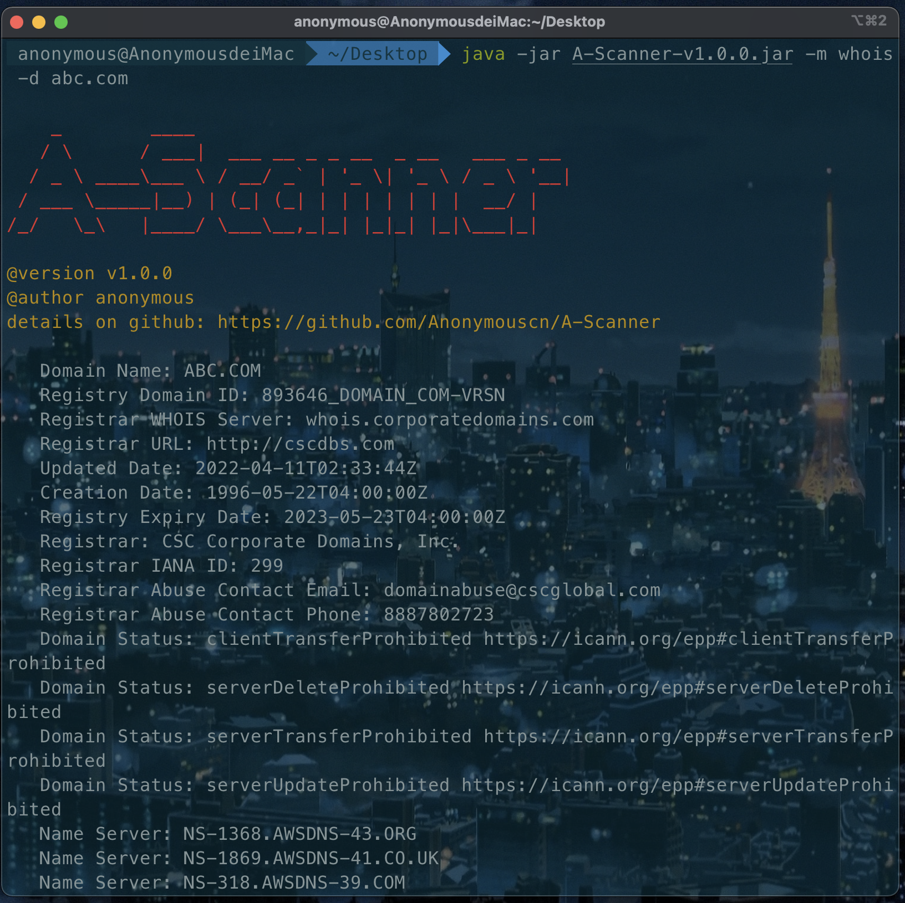
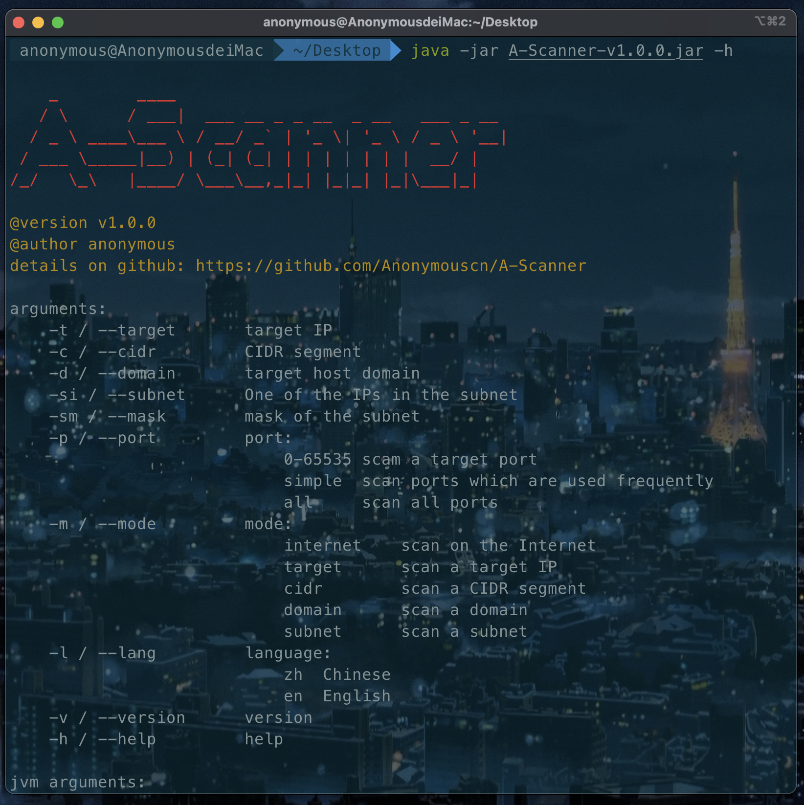
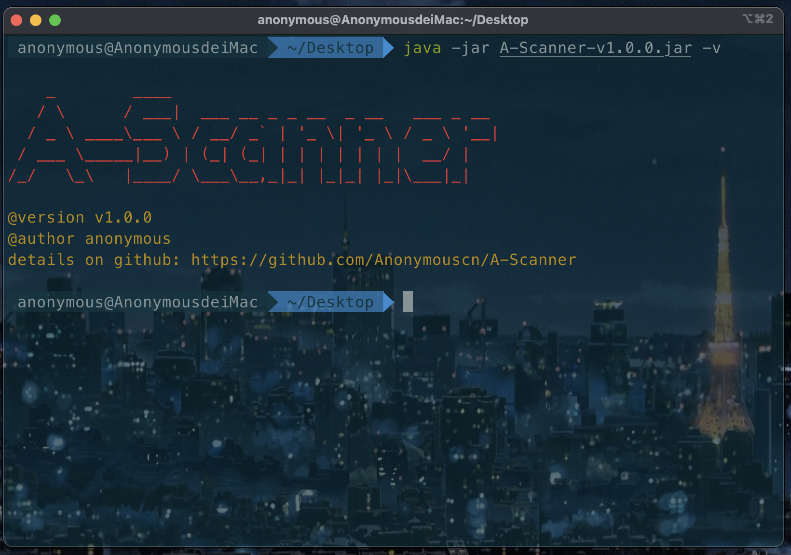

# 目录

# 项目背景

<p>不论从事开发测试还是安全渗透，都需要做一些必要的信息搜集工作。因此，简单编写了一个基于 Java 语言开发的端口扫描器满足需求。</p>
<p>目前具备的功能有：</p>

* 全网扫描
* 针对目标 IPv4 扫描
* 针对目标域名扫描
* 由 CIDR 或 IP + 子网掩码所确定的唯一网段扫描
* 查询域名 whois 信息

<p>扫描类型包括：扫描一个指定端口、扫描常用端口、扫描全部端口</p>

<p>v 2.0 后续将增加的功能：</p>

* IPv6 支持
* 增加系统指纹识别
* 慢扫描和防火墙绕过

# 安装

## Java 环境安装
<p>如果系统已经安装 Java 运行环境或 Java 开发套件且 Java 版本在8及以上可略过此一步。可以查看 Java 版本：</p>

```shell
java -version
```

<p>如未安装 Java 或 Java 版本低于 8 ，安装Java 8 环境：</p>
<p>在Oracle官网上下载 JDK:</p>

[JDK 下载](https://www.oracle.com/java/technologies/downloads/)

<p>下载后压缩包将其解压到你所放置环境到文件夹中，配置环境变量即可，这里不再赘述。</p>


## 下载 Jar 包运行

在 releases 页面下载最新 jar 包 

[转到 releases](https://github.com/Anonymouscn/A-Scanner/releases)

# 使用

<p>扫描目标主机 192.168.2.1 常用端口: </p>

```shell
java -jar A-Scanner-v1.0.0.jar -m target -t 192.168.2.1 -p simple
```


<p>扫描目标主机 192.168.2.1 80 端口: </p>

```shell
java -jar A-Scanner-v1.0.0.jar -m target -t 192.168.2.1 -p 80
```


<p>扫描目标主机 212.64.63.190 所有端口: </p>



<p>扫描域名 abc.com 下主机 443 端口: </p>

```shell
java -jar A-Scanner-v1.0.0.jar -m domain -d abc.com -p 443
```


<p>扫描域名 abc.com 下主机常用端口: </p>

```shell
java -jar A-Scanner-v1.0.0.jar -m domain -d abc.com -p simple
```



<p>扫描域名 abc.com 下主机全部端口: </p>

```shell
java -jar A-Scanner-v1.0.0.jar -m domain -d abc.com -p all
```



<p>扫描网段 192.168.2.0/24 80 端口: </p>

```shell
java -jar A-Scanner-v1.0.0.jar -m cidr -c 192.168.2.0/24 -p 80
```


<p>扫描网段 192.168.2.0/24 常用端口: </p>

```shell
java -jar A-Scanner-v1.0.0.jar -m cidr -c 192.168.2.0/24 -p simple
```


<p>扫描网段 192.168.2.0/24 全部端口: </p>

```shell
java -jar A-Scanner-v1.0.0.jar -m cidr -c 192.168.2.0/24 -p all
```


<p>扫描 IP 192.168.2.190 ， 掩码 255.255.255.0 所在子网的80端口: </p>

```shell
java -jar A-Scanner-v1.0.0.jar -m subnet -sn 192.168.2.190 -sm 255.255.255.0 -p 80
```


<p>扫描 IP 192.168.2.190 , 掩码为 255.255.255.0 所在子网常用端口: </p>

```shell
java -jar A-Scanner-v1.0.0.jar -m subnet -sn 192.168.2.190 -sm 255.255.255.0 -p simple
```


<p>扫描 IP 192.168.2.190 ，掩码为 255.255.255.0 所在子网全部端口: </p>

```shell
java -jar A-Scanner-v1.0.0.jar -m subnet -sn 192.168.2.190 -sm 255.255.255.0 -p all
```



<p>全网扫描 443 端口: </p>

```shell
java -jar A-Scanner-v1.0.0.jar -m internet -p 443
```


<p>全网扫描常用端口: </p>

```shell
java -jar A-Scanner-v1.0.0.jar -m internet -p simple
```


<p>全网扫描所有端口: </p>

```shell
java -jar A-Scanner-v1.0.0.jar -m internet -p all
```


<p>查看域名 whois 信息: </p>

```shell
java -jar A-Scanner-v1.0.0.jar -m whois -d abc.com
```



<p>查看帮助</p>

```shell
java -jar A-Scanner-v1.0.0.jar -h
```



<p>查看版本</p>

```shell
java -jar A-Scanner-v1.0.0.jar -v
```



<p>使用交互模式</p>

```shell
java -jar A-Scanner-v1.0.0.jar
```


<p>默认语言为英文，使用中文输出加上 -l zh 参数: </p>

```shell
java -jar A-Scanner-v1.0.0.jar -l zh
```


# 贡献

<p>如果有任何 bug 或任何问题欢迎提交 issue，以帮助改进程序。如果对该项目有兴趣，也可以创新改进后提交到仓库，期待你的PR!</p>

# 特别说明

<p>该项目仅供学习参考，旨在帮助我们提升工作效率。严禁用于违法用途，请遵守当地各项法律法规。如违反，一切后果自行承担，与该项目作者以及参与的开源爱好者无关。</p>

# 开源许可
[Apache](http://www.apache.org/licenses/LICENSE-2.0) @Anonymouscn