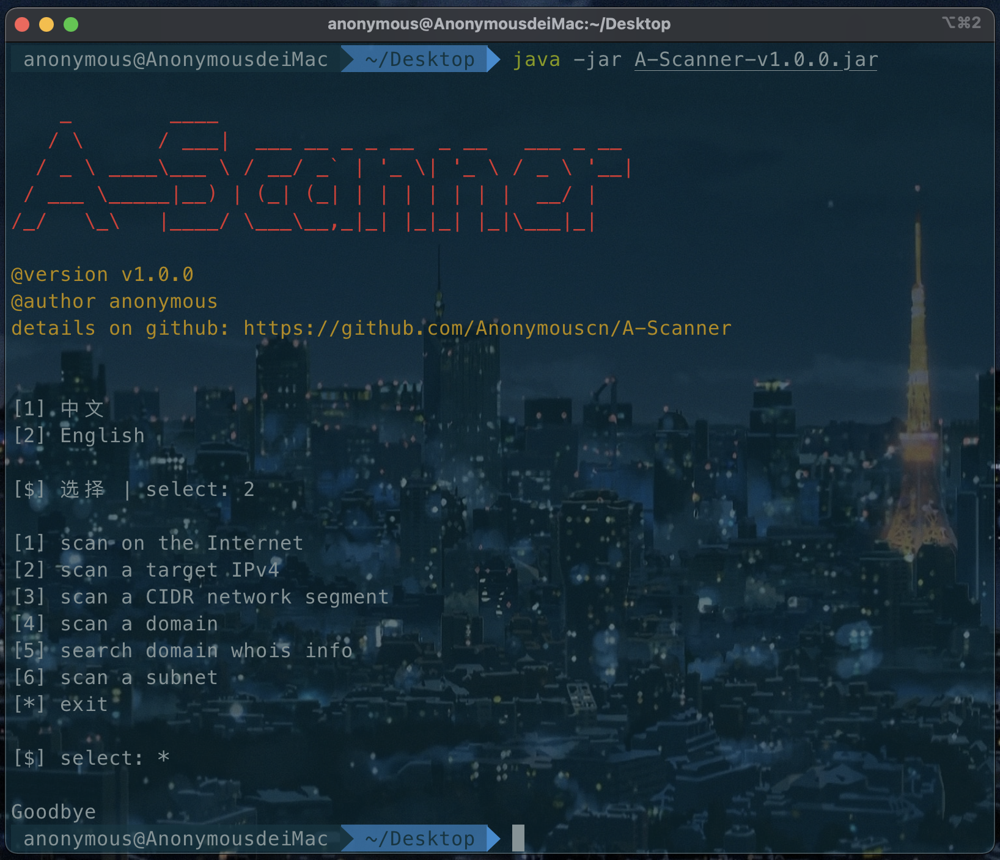

# Table of Contents

# Background

<p>Whether you are engaged in development testing or security penetration, you need to do some necessary information collection. Therefore, a port scanner based on Java language development is simply written to meet the requirements.</p>
<p>Currently available features: </p>

* Scan on the Internet
* Scan against a target IPv4
* Scan against a target domain
* Scan the unique network segments identified by CIDR or IP + subnet mask
* Query domain whois information

<p>Scan types include: scan a specified port, scan common ports, scan all ports</p>

<p>v 2.0 Features to be added later：</p>

* IPv6 support
* Increase system fingerprint recognition
* Slow scan and firewall bypass

# Install

## Java environment install
<p>If the system has installed the Java runtime environment or Java development kit and the Java version is 8 or above, this step can be skipped. You can check the Java version：</p>

```shell
java -version
```

<p>If Java is not installed or the Java version is lower than 8, install the Java 8 environment：</p>
<p>Download JDK from Oracle official website:</p>

[JDK download](https://www.oracle.com/java/technologies/downloads/)

<p>After downloading the compressed package, unzip it to the folder where you placed the environment, and configure the environment variables, so I won’t go into details here.</p>


## Download the Jar archive and run

Download the latest jar archive from the releases page

[go to releases](https://github.com/Anonymouscn/A-Scanner/releases)

# Usage

<p>Scan target host 192.168.2.1 common port: </p>

```shell
java -jar A-Scanner-v1.0.0.jar -m target -t 192.168.2.1 -p simple
```


<p>Scan target host 192.168.2.1 port 80: </p>

```shell
java -jar A-Scanner-v1.0.0.jar -m target -t 192.168.2.1 -p 80
```


<p>Scan target host 212.64.63.190 all ports: </p>


<p>Scan port 443 of the host under the domain abc.com: </p>

```shell
java -jar A-Scanner-v1.0.0.jar -m domain -d abc.com -p 443
```


<p>Scan common ports of hosts under the domain abc.com: </p>

```shell
java -jar A-Scanner-v1.0.0.jar -m domain -d abc.com -p simple
```


<p>Scan all ports of hosts under the domain abc.com: </p>

```shell
java -jar A-Scanner-v1.0.0.jar -m domain -d abc.com -p all
```


<p>Scan network segment 192.168.2.0/24 port 80: </p>

```shell
java -jar A-Scanner-v1.0.0.jar -m cidr -c 192.168.2.0/24 -p 80
```


<p>Scan network segment 192.168.2.0/24 common ports: </p>

```shell
java -jar A-Scanner-v1.0.0.jar -m cidr -c 192.168.2.0/24 -p simple
```


<p>Scan network segment 192.168.2.0/24 all ports: </p>

```shell
java -jar A-Scanner-v1.0.0.jar -m cidr -c 192.168.2.0/24 -p all
```


<p>Scan IP 192.168.2.190 and port 80 of the subnet with mask 255.255.255.0: </p>

```shell
java -jar A-Scanner-v1.0.0.jar -m subnet -sn 192.168.2.190 -sm 255.255.255.0 -p 80
```


<p>Scan IP 192.168.2.190, the mask is 255.255.255.0, which is the common port of the subnet: </p>

```shell
java -jar A-Scanner-v1.0.0.jar -m subnet -sn 192.168.2.190 -sm 255.255.255.0 -p simple
```


<p>Scan IP 192.168.2.190, the mask is 255.255.255.0 all ports in the subnet: </p>

```shell
java -jar A-Scanner-v1.0.0.jar -m subnet -sn 192.168.2.190 -sm 255.255.255.0 -p all
```


<p>Scan port 443 of all hosts on the Internet: </p>

```shell
java -jar A-Scanner-v1.0.0.jar -m internet -p 443
```


<p>Scan the common ports of all hosts on the Internet: </p>

```shell
java -jar A-Scanner-v1.0.0.jar -m internet -p simple
```


<p>Scan all ports of all hosts on the Internet: </p>

```shell
java -jar A-Scanner-v1.0.0.jar -m internet -p all
```


<p>View domain name whois information: </p>

```shell
java -jar A-Scanner-v1.0.0.jar -m whois -d abc.com
```


<p>View help</p>

```shell
java -jar A-Scanner-v1.0.0.jar -h
```


<p>View version</p>

```shell
java -jar A-Scanner-v1.0.0.jar -v
```


<p>use interactive mode</p>

```shell
java -jar A-Scanner-v1.0.0.jar
```



<p>The default language is English, if you want to use Chinese as output please add '-l zh' parameter: </p>

```shell
java -jar A-Scanner-v1.0.0.jar -l zh
```


# Contributing

<p>If there are any bugs or any problems, please submit an issue to help improve the program. If you are interested in this project, you can also submit it to the warehouse after innovation and improvement, looking forward to your PR!</p>

# Important

<p>This project is for learning reference only and aims to help us improve work efficiency. It is strictly forbidden to be used for illegal purposes, please abide by local laws and regulations. In case of violation, all consequences shall be borne by oneself, and have nothing to do with the author of the project and the participating open source enthusiasts.</p>

# License

[Apache](http://www.apache.org/licenses/LICENSE-2.0) @Anonymouscn
